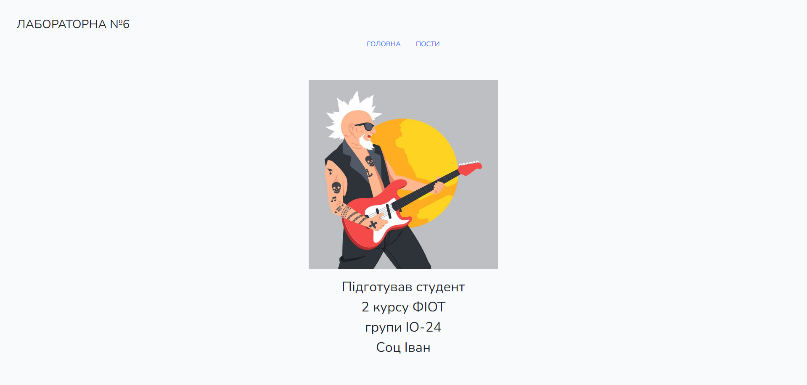
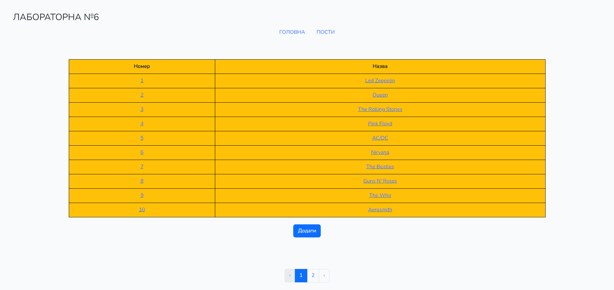
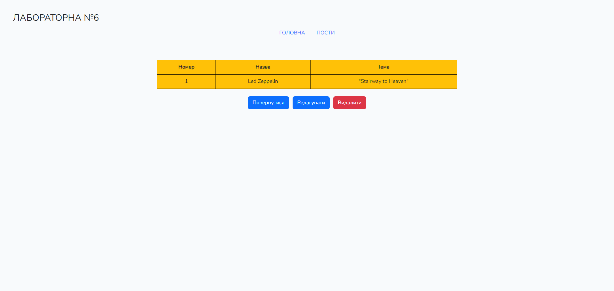
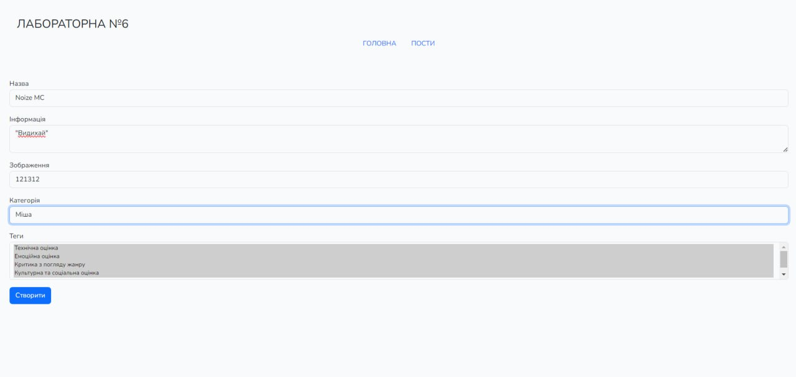
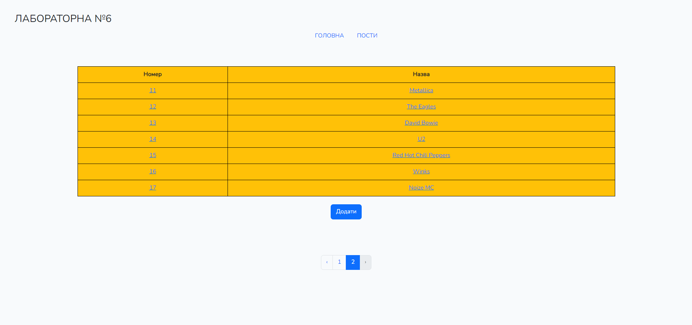
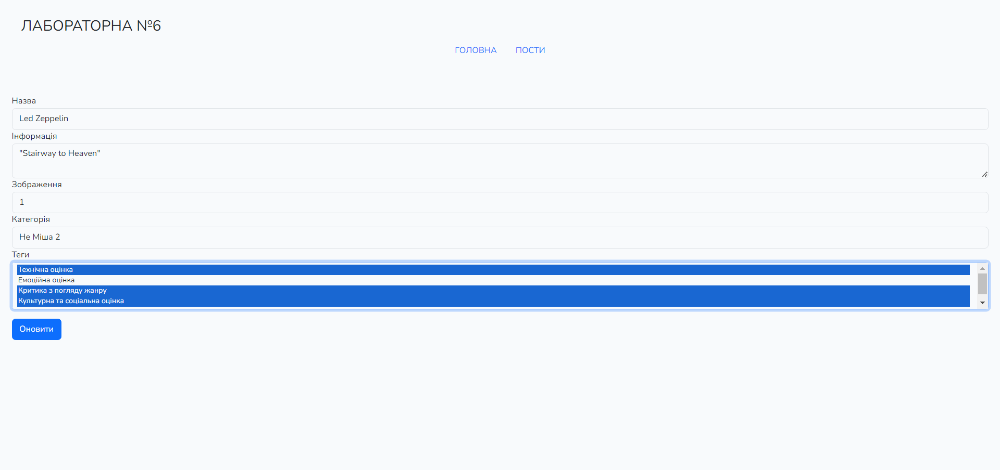
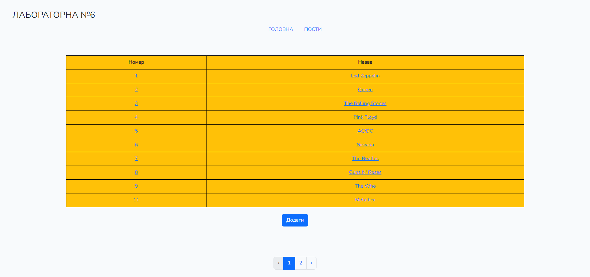
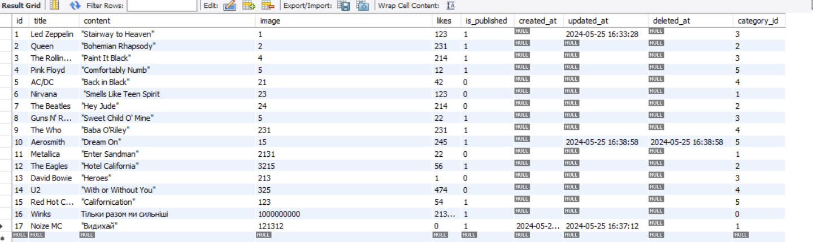

# Тестування працездатності системи ІО-24 Соц Іван

## CRUD
[CRUD](https://uk.wikipedia.org/wiki/CRUD) — 4 основні функції управління даними, які включають в себе "створення, читання, оновлення і вилучення".

### Main

### Create

### Update

### Delete

